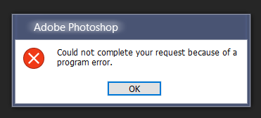
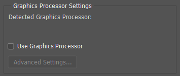
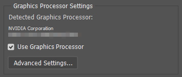

# DXGI wrapper for Photoshop

# Intro

In Photoshop 2021 Direct3D interface was updated to version 12 and some systems don't have Direct3D 12 installed.
DXGI wrapper for Photoshop is useful if you get "Could not complete your request because of a program error" message related to your videocard detection (Detected Graphics Processor: none).

Target product: Adobe Photoshop 2021

## Before fix:

## After fix:

# Installation

1. Use `install.cmd` to install. Change `dest` path if needed.
2. Clear configuration folder: `%AppData%\Adobe\Adobe Photoshop 2021`

# Uninstallation

- Run `uninstall.cmd` to uninstall. Change `dest` path if needed.

# Congiguration

## vcruntime_ldr.ini

- Do not change anything in this file

## gpu.ini

### Primary parameters

| Option	| Values	| Comment	|
|-----		|------		|---------|
|d3d12		|		|Infterface used to initalize internal components
|		|auto		|Default
|		|d3d12on7	|Use DirectX 12 on Windows 7 (requires additional components)
|		|vulkan		|Use Vulkan API. Used for videocard info only.
|		|		|May be used on Wine and Windows 7, 8, 8.1. NOT TESTED.
|owlfix		|		|Fix bug in `adobeowl.dll` (white screen or crash at startup splash screen)
|		|auto		|Default, must be changed. Always verify manually before usage.
|		|true		|If fix is required
|		|false		|If fix is not required

# Windows Versions

## Windows 10

If Windows 10 version 1803 or newer is detected, then no wrapper required.

Affected [Windows 10 editions](https://en.wikipedia.org/wiki/Windows_10_editions):

| Version	| Title	|
|----	|------|
|1507	|Initial release
|	|[LTSC 2015](https://docs.microsoft.com/en-us/windows/whats-new/ltsc/)
|1511	|November Update
|1607	|Anniversary Update
|	|LTSC 2016
|1703	|Creators Update
|1709	|Fall Creators Update

Including all builds between releases.

## Windows 7

1. Install Microsoft Direct3D D3D12On7.
2. Comment `goto End` line #18 in `install.cmd` to install required libraries.
3. Install all components using `install.cmd`.

WARNING: NOT TESTED

## Windows 8 and 8.1

1. Use `d3d12=vulkan` option in `gpu.ini`
2. Comment `goto End` line #18 in `install.cmd` to install required libraries.
3. Install all components using `install.cmd`.

WARNING: NOT TESTED

# Glossary

## DXGI

- DirectX Graphics Infrastructure (DXGI)
